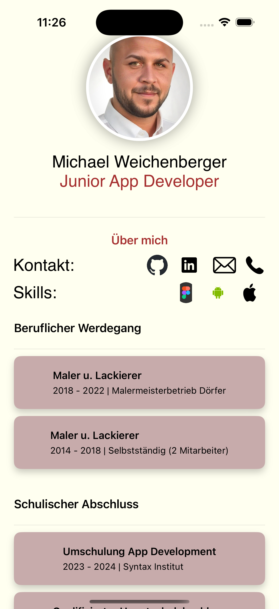

# CV-App

Eine iOS-App zur Präsentation des Lebenslaufs von Michael Weichenberger, entwickelt mit SwiftUI.

## Beschreibung

Diese App bietet eine übersichtliche und interaktive Möglichkeit, den Lebenslauf von Michael Weichenberger aufzurufen. Sie enthält Informationen zu seiner beruflichen Erfahrung, Bildung, Fähigkeiten und Kontaktdaten.

## ✨ Hauptmerkmale

*   **Benutzerfreundliche Oberfläche:** 
    Einfache Navigation und intuitive Bedienung.
*   **Detaillierte Informationen:** 
    Umfassende Angaben zu den beruflichen Stationen und Bildungsabschlüssen.
*   **Fähigkeiten und Kontakt:** 
    Auflistung der wichtigsten Fähigkeiten sowie der Kontaktdaten für eine einfache Kontaktaufnahme.
*   **Über mich Seite:** 
    Zusätzliche Einblicke in die Person von Michael Weichenberger.

    ## Screenshots

*   **Über Mich Seite:**
      <-- Korrekt

*   **Homescreen:**
      <-- Korrekt

## ⚙️ Technologien

*   SwiftUI
*   Swift

## ️ Installation

1.  Stellen Sie sicher, dass Sie Xcode auf Ihrem Mac installiert haben.
2.  Laden Sie den Quellcode der App von [GitHub Repository URL] herunter.
3.  Öffnen Sie das Projekt in Xcode.
4.  Wählen Sie ein Zielgerät (Simulator oder echtes Gerät) aus.
5.  Klicken Sie auf den Play-Button, um die App zu kompilieren und auszuführen.

##  Verwendung

1.  Starten Sie die App auf Ihrem Gerät.
2.  Navigieren Sie durch die verschiedenen Abschnitte, um Informationen zu Michael Weichenberger's Lebenslauf zu erhalten.
3.  Nutzen Sie die Kontakt-Seite, um mit Michael in Verbindung zu treten.

## ️ Struktur des Repositorys

*   `CV-App/`: Enthält den Quellcode der App.
*   `CV-App/Assets.xcassets`: Enthält Assets wie Bilder und Icons.
*   `CV-App/Info.plist`: Konfigurationsdatei für die App.
*   `README.md`: Diese Datei.

## ‍ Mitwirkende

*   Michael Weichenberger (Entwickler)

##  Kontakt

*   Michael Weichenberger

##  Lizenz

*   [Fügen Sie hier die Lizenzinformationen ein (z.B. MIT-Lizenz)]

##  Danksagungen

*   [Erwähnen Sie hier alle Personen oder Projekte, die zur Entwicklung der App beigetragen haben.]

##  Zukünftige Erweiterungen

*   [Fügen Sie hier eine Liste von geplanten Funktionen oder Verbesserungen hinzu.]
